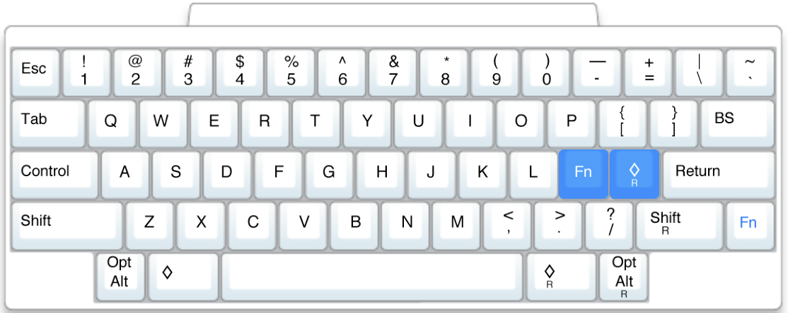
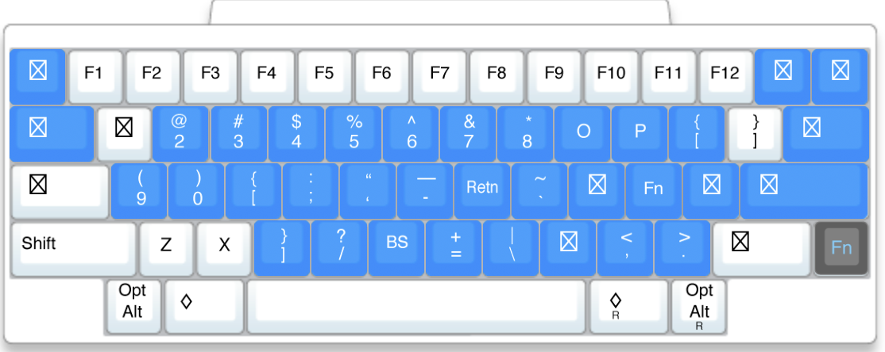

# macOS セットアップ

このリポジトリは、macOS開発環境の初期設定を自動化するためのスクリプトと設定ファイルのコレクションです。
`make`コマンドを通じて、以下の設定を実行します。

*   **macOSシステム設定**: `defaults`コマンドによるキーリピート、トラックパッド、Finder、Dockなどのカスタマイズ
*   **パッケージ管理**: Homebrewを使ったCLIツール、開発ツール、GUIアプリケーションのインストール
*   **設定ファイルの展開**: `stow`によるzsh設定のシンボリックリンク作成
*   **開発環境**: Neovim (LazyVim), Git, Ghostty, Karabiner-Elementsの設定
*   **言語環境**: Go, OCaml, Pythonの環境構築

## 前提条件

スクリプトを実行する前に、**Homebrew** と **Xcode Command Line Tools** がインストールされていることを確認してください。

### 1. Xcode Command Line Tools のインストール

インストールされていない場合は、以下のコマンドを実行してください。

```bash
xcode-select --install
```

### 2. Homebrew のインストール

Homebrew は macOS 用のパッケージマネージャーです。インストールされていない場合は、[Homebrew 公式ウェブサイト](https://brew.sh/) の手順に従ってインストールしてください。

インストール後、Homebrew を PATH に追加する必要があります。以下のコマンドを実行してください。

```bash
echo 'eval "$(/opt/homebrew/bin/brew shellenv)"' >> ~/.zprofile
eval "$(/opt/homebrew/bin/brew shellenv)"
```

変更を反映させるには、ターミナルを再起動するか、`source ~/.zprofile` を実行する必要がある場合があります。


## インストール方法

リポジトリをクローンした後、以下の`make`コマンドを実行してセットアップを開始します。

```bash
git clone https://github.com/<your_username>/setup_mymac.git
cd setup_mymac
make all-auto
make all-manual
```

> **Note**: `your_username` の部分は、ご自身のGitHubユーザー名に置き換えてください。

- `make all-auto` は、完全に自動化できるすべてのセットアップタスクを実行します。
- `make all-manual` は、手動での入力や確認が必要なセットアップタスクを実行します。
- 言語環境が必要な場合は、`make all-lang` や `make go` などの個別コマンドを実行してください。

## `make` コマンド一覧

`make help` を実行すると、利用可能なすべてのコマンドとその説明が表示されます。

| ターゲット       | 説明                                                                                                                            |
| ---------------- | ------------------------------------------------------------------------------------------------------------------------------- |
| `all-auto`       | **(推奨・ステップ1)** 自動化可能なすべてのセットアップ (`defaults`, `brew-cli`, `zsh`) を実行します。(個人的なmacOS設定の変更を含みます) |
| `all-manual`     | **(推奨・ステップ2)** GUIアプリのインストールなど手動操作が必要なセットアップ (`brew-gui`, `ghostty`, `karabiner`, `git`, `nvim`) を実行します。 |
| `defaults`       | macOSのシステム設定 (`setup_defaults.sh`) を適用します。**警告:** このスクリプトはDockやホットコーナーの挙動など、UI/UXを大きく変更する個人的な設定を多く含みます。実行前に中身を確認し、不要な行はコメントアウトしてください。 |
| `brew-cli`       | `Brewfile.cli` に基づいてすべてのCLIツールをインストールします。                                                                  |
| `brew-gui`       | `Brewfile.gui` に基づいてすべてのGUIアプリケーションをインストールします。パスワード入力を求められることがあります。              |
| `git`            | Gitのユーザー名とメールアドレスを対話形式で設定します。                                                                         |
| `nvim`           | Neovim (LazyVim) の設定をバックアップし、新しい設定をクローンします。                                                           |
| `zsh`            | `stow` を使って `zsh/.zshrc` をホームディレクトリにシンボリックリンクします。                                                     |
| `karabiner`      | Karabiner-Elements の設定ファイルを配置します。                                                                                 |
| `ghostty`        | Ghostty ターミナルの設定ファイルを配置します。                                                                                  |
| `python`         | Pythonの開発環境を `pyenv` と `uv` を使ってセットアップします。                                                                 |

## セットアップ後の手動ステップ

> `make`コマンド実行後、いくつかの手動設定が必要です。
> 
> 1.  **ターミナルの再起動**:
>     `.zshrc` に追加されたPATHや設定を反映させるため、ターミナルを再起動してください。
> 2.  **GitHub CLI (gh) の認証**:
>     `setup_neovim.sh` は `gh` の認証を必要とします。もし認証が完了していない場合は、以下のコマンドでログインしてください。
>     ```bash
>     gh auth login
>     ```
> 3.  **Karabiner-Elements のルール有効化**:
>     設定ファイルは自動で配置されますが、Karabiner-ElementsのGUIアプリケーションを開き、「Complex Modifications」タブから手動でルールを有効にする必要があります。
> 4.  **Neovim プラグインのインストール**:
>     初めて `nvim` を起動すると、LazyVimが自動的にプラグインのインストールを開始します。完了するまで待ってください。
> 5.  **フォントの設定**:
>     VSCodeで、`Brewfile`でインストールした `HackGen Nerd Font` などのNerd Fontフォントを設定してください。
> 6.  **GUIアプリケーションの初期設定**:
>     `brew cask`でインストールされたGUIアプリケーション（例: Rectangle, Docker Desktopなど）は、個別に起動して初期設定や権限の許可を行う必要があります。

## キーマッピングについて

本設定はキーのリマッピングソフトウェアであるKarabilner-Elements を導入します。ホームポジションから手を動かすことなく快適なコーディングと操作を実現することを目指し、キーボードマッピングを大幅に変更します。これは、セミコロン（`;`）キーを長押しすることで有効になる2つの主要なレイヤーによって実現されます。


### レイヤー1: 基本レイヤー

これは標準的なキーボードレイアウトです。セミコロンキーは、レイヤー2にアクセスするための主要な`Fn`キーとして再利用されます。



### レイヤー2: Fnレイヤー（セミコロンキー）

セミコロンキーを長押しすると、ナビゲーション、記号、ファンクションキーなどを網羅した第2のレイヤーが有効になり、必要なすべてが指先で完結します。

*   **ナビゲーション**: ホームポジション周辺のキーで、矢印（`K`, `L`など）、`Home`/`End`（`I`/`P`）、`PageUp`/`PageDown`（`U`/`J`）を操作できます。
*   **記号**: `()`、`{}`、`[]`、`|`、`~` といったプログラミングで頻出する記号を、ホームポジションやその周辺から直接入力できます。
*   **ファンクションキー**: 数字キー列がF1〜F12キーとして機能します。
*   **システム制御**: `Q`キーと`A`キーで音量を調整できます。




## カスタマイズ

このセットアップは、各設定ファイルを編集することで簡単にカスタマイズできます。

*   **アプリケーションとツール**: Edit `Brewfile.cli` (for command-line tools) and `Brewfile.gui` (for GUI applications) to add or remove packages.
*   **シェル設定**: `zsh/.zshrc` を編集して、エイリアスや関数、シェルの挙動を変更します。
*   **キーボードマッピング**: `karabiner_element/` ディレクトリ内の `.json` ファイルを編集して、Karabiner-Elementsのキーマッピングをカスタマイズします。
*   **セットアップロジック**: 各 `setup_*.sh` スクリプトを直接編集して、個別のセットアップ処理を変更します。

## 参考サイト
- defaults コマンドによる mac os の各種パラメータの設定：https://macos-defaults.com/
- homebew 公式サイト：https://brew.sh/

